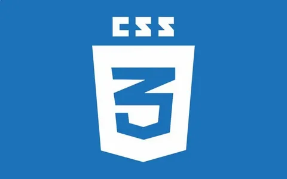
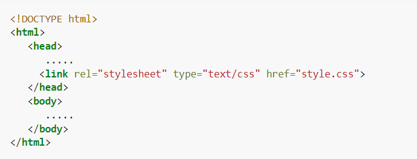
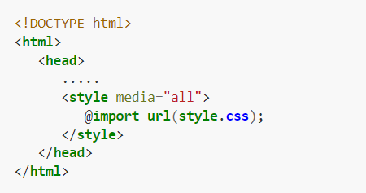
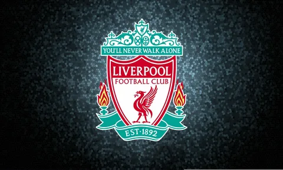

# CSS

###  формальный язык декодирования и описания внешнего вида документа (веб-страницы), написанного с использованием языка разметки (чаще всего HTML или XHTML). Также может применяться к любым XML-документам, например, к SVG или XUL.
# Использование CSS
### CSS используется создателями веб-страниц для задания цветов, шрифтов, стилей, расположения отдельных блоков и других аспектов представления внешнего вида этих веб-страниц. Основной целью разработки CSS является ограждение и отделение описания логической структуры веб-страницы (которое производится с помощью HTML или других языков разметки) от описания внешнего вида этой веб-страницы (которое теперь производится с помощью формального языка CSS). Такое разделение может увеличить доступность документа, предоставить большую гибкость и возможность управления его представлением, а также уменьшить сложность и повторяемость в структурном содержимом.

### когда описание стилей находится в отдельном файле, оно может быть подключено к документу посредством элемента <link>, включённого в элемент <head>:4

# Когда файл стилей размещается отдельно от родительского документа, он может быть подключён к документу инструкцией @import в элемент

# Правила построения CSS
#### селектор, селектор {
####  свойство: значение;
####  свойство: значение;
####  свойство: значение;
#### }
## Универсальный селектор
### * {
####   margin: 0; 
####   padding: 0; 
#### }
### Основное различие между классами элементов и идентификаторами элементов в том, что идентификатор предназначен для одного элемента, тогда как класс обычно присваивают сразу нескольким. Тем не менее, современные браузеры, как правило, корректно отображают множественные элементы с одинаковым идентификатором. Также различие в том, что могут существовать множественные классы (когда класс элемента состоит из нескольких слов, разделённых пробелами). Для идентификаторов такое невозможно.
### Важно отметить следующее отличие идентификатора от класса: идентификаторы широко используются в JavaScript для нахождения уникального элемента в документе.

### Имена классов и идентификаторов, в отличие от названий тегов и их атрибутов, чувствительны к регистру ввода букв.
#
#
# Ливерпуль (футбольный клуб)
#
## «Ливерпу́ль» (полное название — Футбольный клуб «Ливерпуль», англ. Liverpool Football Club, английское произношение: ['lɪvəpu:l 'futbɔ:l klʌb]) — английский профессиональный футбольный клуб из одноимённого города, расположенного в графстве Мерсисайд. Был основан в 1892 году; в следующем году вступил в Футбольную лигу Англии. С момента своего создания проводит домашние игры на стадионе «Энфилд». Стадион был построен в 1884 году, на нём изначально играл другой ливерпульский футбольный клуб, «Эвертон»[4]. «Энфилд» вмещает более шестидесяти одной тысячи болельщиков[2].
## «Ливерпуль» является 19-кратным чемпионом Англии, 8-кратным обладателем Кубка Англии, 10-кратным обладателем Кубка лиги, 16-кратным обладателем Суперкубка Англии, 3-кратным обладателем Кубка УЕФА, 6-кратным победителем Лиги чемпионов, 4-кратным обладателем Суперкубка УЕФА[5]. В общей сложности «Ливерпуль» выигрывал еврокубки тринадцать раз, что является четвёртым результатом после мадридского «Реала», «Милана» и «Баварии». Самый успешный период в истории клуба приходится на 1970-е и 1980-е годы, когда командой руководили Билл Шенкли и Боб Пейсли, которые совместно на двоих выиграли 11 чемпионских титулов и 7 европейских трофеев.